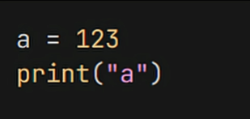

# Welcome to Kagansoft!

## About Me
I am a software developer focused on system stability, legacy OS optimization, disk and hardware programs, old/modern [scripting languages.](https://en.wikipedia.org/wiki/Scripting_language) and *other things...* I enjoy building efficient applications. (I dont have real company btw.) 

*And Im going to school...*

- ⚠️ Sometimes I undertake projects that are **necessary or unnecessary.**
- ⚡ **Programming Languages:** VB .NET, C#, Python, AutoHotKey, Rust, HTML
- 🛠️ **Development Tools:** [Visual Studio 2017](https://en.wikipedia.org/wiki/Visual_Studio#2017), [Visual Studio Code](https://code.visualstudio.com/), [PyScripter](https://sourceforge.net/projects/pyscripter/), [Godot Engine](https://godotengine.org/), [Tauri Engine](https://v2.tauri.app)
- 💾 **Legacy Support:** I sometimes make some of my projects compatible with [Windows XP SP2](https://en.wikipedia.org/wiki/Windows_XP#Service_Pack_2) and lower versions (Because of the [.NET Framework](https://en.wikipedia.org/wiki/.NET_Framework) version I guess.) *(Ahh... I love Nostalgia!)*

*My Markdown Skills are so bad these days because of that I use AI sometimes (or copy from other profiles readme document)...*
*And if you're wondering why I'm not creating a new repo, it's because I can't find any ideas.*

